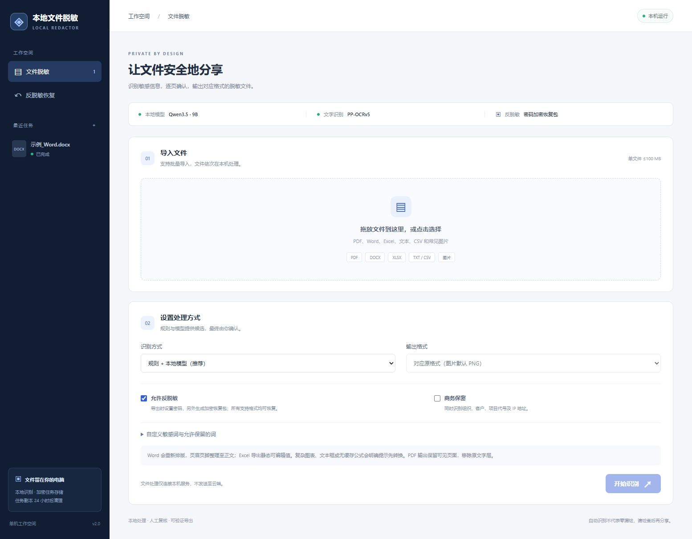
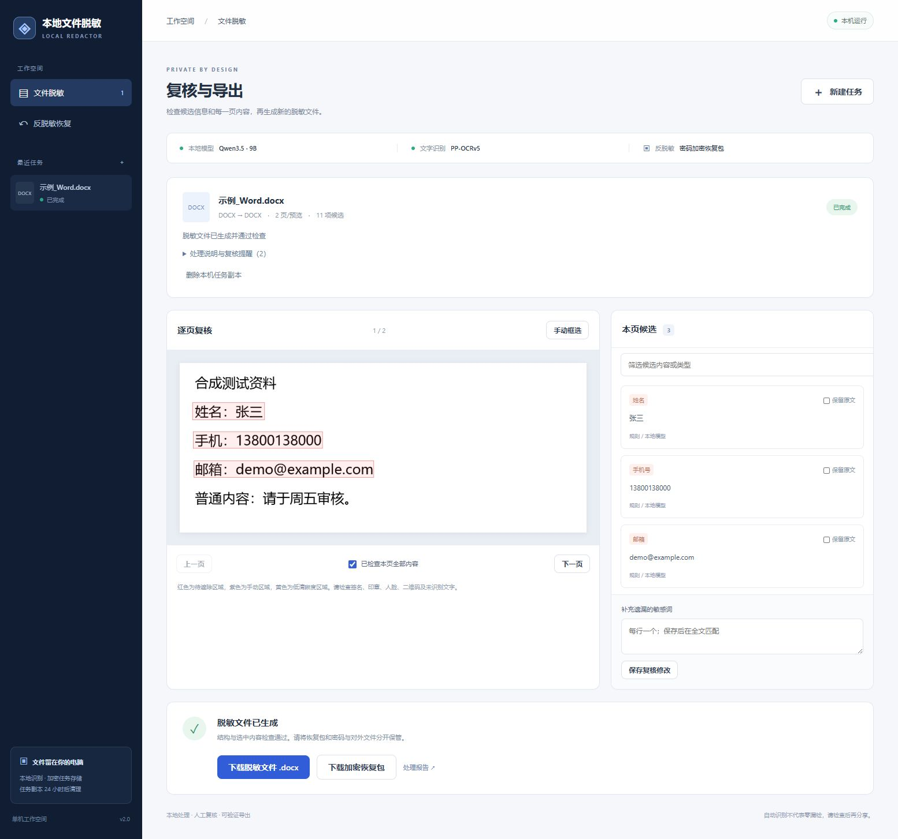
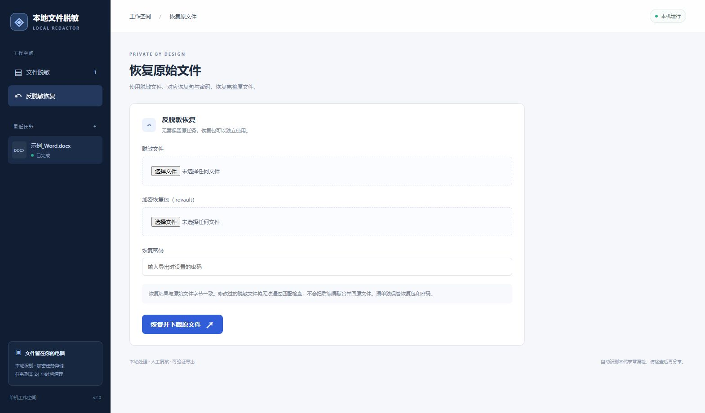
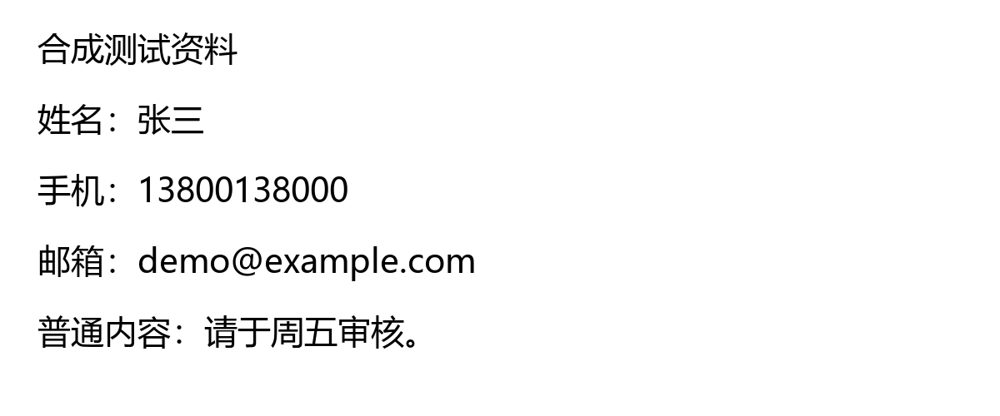

<div align="center">

# 本地文件脱敏 · Local File Redactor

**文件留在本机，敏感信息可复核，原始文件可加密恢复。**

**简体中文** | [English](README.en.md)

Windows · Python 3.12 · React 19 · Qwen3.5 9B · PP-OCRv5

[快速开始](#快速开始) · [环境要求](#环境要求) · [试验效果](#试验效果) · [代码结构](#代码结构)

</div>

本地文件脱敏是一款面向中文文档的开源桌面浏览器工具，将**本地大模型、OCR、规则识别和人工逐页复核**结合起来，识别并遮除姓名、电话、邮箱、证件号、银行账号、地址和自定义敏感词。支持 Word、Excel、PDF、文本、CSV 和常见图片，并可通过密码加密的恢复包还原完整原件。

仓库包含前后端主要代码、安装脚本、合成样例、真实界面截图和测试记录。**不包含大模型/OCR 权重、Python/Ollama 可执行程序、私人任务数据或真实用户文件**；模型需在本机单独下载。初次安装需要联网，准备完成后文件处理使用本机服务。



## 主要功能

| 功能 | 说明 |
|---|---|
| 多格式输入与输出 | DOCX→DOCX/PDF，XLSX→XLSX/PDF，PDF→PDF，TXT→TXT，CSV→CSV，图片可在支持格式间转换 |
| 本地识别 | Qwen3.5 9B 语义识别 + PP-OCRv5 中文 OCR + 规则与词典；也可明确选择仅规则模式 |
| 人工复核 | 逐页预览、选择保留原文、补充敏感词、图片手动框选；全部页面确认后才能导出 |
| 像素脱敏 | PDF/图片及 Office 插图实际改写像素；重建 PDF，不保留原 PDF 文字层或注释对象 |
| 原生 Office 成品 | 重建干净、静态、可编辑的 DOCX/XLSX；基础段落、表格和可见单元格可保留 |
| 加密反脱敏 | 所有支持格式都可生成 `.rdvault`，凭对应成品和密码精确恢复原始文件字节 |
| 本地数据保护 | AES-GCM 任务加密、Windows DPAPI 密钥保护、内存上传缓冲、一次性本机配对及 CSRF 检查 |
| 任务管理 | 串行批量队列、取消、重试、删除；过期非活动任务自动清理，导出版本与复核版本绑定 |

> 自动识别不能保证零漏检。导出前必须逐页检查，尤其是手写、印章、人脸、二维码、低清晰度文字及复杂排版。Office 输出会简化版式，反脱敏恢复原始文件，不合并成品后续编辑。

## 支持的文件

| 输入类型 | 输出类型 | 说明 |
|---|---|---|
| `.txt` | `.txt` | 支持 UTF-8、带 BOM 的 UTF-16、GB18030 等输入；输出 UTF-8 |
| `.csv` | `.csv` | 保留分隔符、多行字段，防护公式型单元格；输出带 BOM 的 UTF-8 |
| `.docx` | `.docx` / `.pdf` | 处理正文、表格、页眉页脚及插图；采用简化排版 |
| `.xlsx` | `.xlsx` / `.pdf` | 保留可见数据及基本列宽，公式转换为缓存值 |
| `.pdf` | `.pdf` | 300 DPI 渲染、OCR/文字层定位、像素遮挡、重建无原文字层的 PDF |
| `.png` / `.jpg` / `.jpeg` / `.webp` / `.bmp` | 上述任一图片类型 | 单帧图片、像素遮挡、重新编码；默认 PNG |

旧版 DOC/XLS、PPT/PPTX、宏文件、多帧图片暂不支持。Office 图表、文本框、SmartArt、嵌入对象、外部数据或没有缓存值的公式，会要求先转为静态文件。隐藏内容不会直接带入成品。详见[限制与数据处理](docs/ARCHITECTURE.md)。

## 界面预览

### 候选复核与导出

左侧预览中的红框表示待遮除区域，右侧列出候选及来源。截图使用仓库内的合成 Word 样例，正文和插图分别复核。



### 反脱敏恢复

选择**未经修改的脱敏文件 + 对应恢复包 + 导出密码**，即可恢复完整原件。错误密码、被修改的成品或不匹配的恢复包都会被拒绝。



README 可切换中英文；当前应用界面为中文。

## 试验效果

下图为**真实合成样例的处理前后**。右图直接取自已导出 DOCX 的嵌入图片，未对结果图做美化或额外遮挡；OCR 当前按识别行生成框，因此可能遮除整行。

| 原始图片 | 脱敏后插图 |
|---|---|
|  |  |

- [合成 Word 原件](examples/input/word.docx) · [脱敏 DOCX 成品](examples/output/word.redacted.docx)
- [全部合成输入](examples/input)包括 TXT、CSV、DOCX、XLSX、PNG 和扫描 PDF。
- 示例 Word 实际识别到 **2 个复核页面、11 项候选**，包含正文、表格、页眉和插图中的信息。
- 独立检查成品 XML 与插图 OCR，选中的姓名、手机号、邮箱和地址未残留；普通说明文字仍存在。
- 恢复后原件与输入文件的 SHA-256 一致；报告、错误密码、文件匹配与版本校验也已验证。

| 验证项目 | 已观察结果 | 范围 |
|---|---|---|
| 已部署版本回归 | 41 个不同测试用例通过 | 含真实本地模型/OCR、文件恢复、上传保护、PDF 旋转与历史清理 |
| 开源目录默认测试 | 33 通过、11 跳过 | 跳过需要另行下载模型/OCR 的集成测试；新增模型准备脚本检查 |
| 浏览器流程 | Word 识别、复核、导出、恢复成功 | 合成资料，中文界面实际操作 |
| 9B 短文本调用 | 约 11.41 秒冷启动；1.84 / 1.70 秒预热后 | 三条合成输入，仅模型调用，不是整份文档耗时 |
| 离线重建 | 新目录中的完整 Python + 新虚拟环境通过 | 同一台 Windows 电脑，不代表跨硬件验收 |

这些结果是功能回归与小样本试运行，**不是检出率或零泄露证明**。没有完成 120 份文件、300 页、3000 个标注实体的系统基准，未声称 99% 准确率。更多记录见[试验说明](docs/VALIDATION.md)和[机器可读回归摘要](docs/benchmarks/regression-summary.json)。

## 环境要求

当前发行版面向 **Windows x64 单用户本机部署**。Windows DPAPI 和 Microsoft YaHei 字体是现有实现依赖；macOS/Linux 尚未适配。

| 项目 | 要求或建议 | 本次验证配置 |
|---|---|---|
| 操作系统 | Windows 10 22H2 或更新版本 / Windows 11，64 位 | Windows x64 |
| Python | 官方完整 Python 3.12 x64，包含 SQLite/SSL/venv | 3.12.10 |
| Node.js | Node.js 22，用于安装和构建前端；运行成品时不需要 | 22.17.1 |
| GPU | 9B 模型建议 12GB 显存级 NVIDIA GPU | RTX 3060 12GB，驱动 576.02，CUDA 12 后端 |
| 内存 | 建议至少 16GB，较大文件建议 32GB；非严格性能门槛 | 未进行多机内存压力基准 |
| 磁盘 | 建议预留至少 20GB 给运行库、权重、依赖及任务 | Qwen 模型资料约 6.59GB，另有 OCR 与运行库 |
| 中文字体 | `C:/Windows/Fonts/msyh.ttc` | Microsoft YaHei |
| 本机端口 | 8080（应用）、11434（模型），需未被其他项目占用 | 均仅绑定回环地址 |

本项目固定 Ollama **0.33.3**、Qwen3.5 **9B Q4_K_M**、PaddleOCR **3.3.2**、PaddlePaddle **3.2.2**。CPU 推理或其他 GPU 可能更慢，未做完整验收；当前启动配置选用 CUDA 12。Ollama 的一般系统要求参见[官方 Windows 文档](https://docs.ollama.com/windows)。

## 快速开始

### 1. 获取源码并安装环境

通过 GitHub 的 **Code → Download ZIP** 下载解压，或克隆本仓库。进入项目根目录后，在 PowerShell 中运行：

```powershell
git clone https://github.com/ilovemiku520/local-file-redactor.git
cd local-file-redactor
```

```powershell
powershell.exe -NoProfile -ExecutionPolicy Bypass -File .\scripts\setup.ps1
```

脚本默认使用 Python Launcher 的 `py -3.12`，创建项目 `.venv`，安装固定依赖，运行 `npm ci` 并构建前端。若未安装 Python Launcher，可明确指定 Python：

```powershell
powershell.exe -NoProfile -ExecutionPolicy Bypass -File .\scripts\setup.ps1 -PythonExe 'D:\Python312\python.exe'
```

请使用完整的[官方 Python 安装](https://www.python.org/downloads/release/python-31210/)，不要只复制 `python.exe`，否则可能缺少 `sqlite3.dll` 等依赖。先安装 [Node.js](https://nodejs.org/en/download)，并确保 `npm.cmd` 可用。

### 2. 单独下载本地模型

先退出其他占用 11434 端口的 Ollama 实例，再运行：

```powershell
.\.venv\Scripts\python.exe -I scripts\prepare_models.py
```

脚本从上游下载 Ollama、PP-OCRv5、tokenizer 和 `qwen3.5:9b`，放入被 Git 忽略的 `runtime/`。**不会读取或上传待脱敏文件**。下载后检查官方 Ollama 压缩包、OCR、tokenizer、模型 manifest 和 blob 的 SHA-256；版本固定信息在 [models.lock.json](models.lock.json)。上游同名标签变化导致校验失败时，应审阅版本后更新锁定信息，不要跳过检查。

已有模型可只执行完整性检查：

```powershell
.\.venv\Scripts\python.exe -I scripts\prepare_models.py --check
```

### 3. 启动与使用

双击根目录 **`start.cmd`**。启动器打开 `http://127.0.0.1:8080` 并自动进行一次性本机配对。直接输入网址提示未配对时，重新双击启动入口。

1. 导入文件，选择识别方式、输出格式与是否允许反脱敏。
2. 等待识别，逐页检查候选；补充漏检内容，确认每一页。
3. 开启反脱敏时设置至少 10 个字符的密码，再导出。
4. 下载脱敏成品、加密恢复包和处理报告，并分开保管恢复包与密码。

停止服务：双击 **`stop.cmd`**。关闭网页不会自动停止模型服务。

## 代码结构

```text
backend/app/
  main.py          本机 API、配对、复核、任务与下载控制
  engine.py        解析 → 识别 → 复核 → 导出 → 校验
  detection.py     规则、词典、本地 tokenizer 与模型抽取
  formats.py       TXT/CSV/DOCX/XLSX 解析及干净重建
  raster.py        OCR、PDF 渲染、坐标映射和像素遮挡
  storage.py       加密文件与 SQLite 任务存储
  vault.py         密码加密恢复包与精确还原
  transport.py     上传大小限制与内存接收
  worker.py        单任务进程及本机网络限制
frontend/src/      React + TypeScript 中文界面
scripts/           源码安装、模型准备、发布内容审计
backend/tests/     单元、文件流程、API 与恢复测试
docs/assets/       实拍界面与实际脱敏效果图
examples/          可公开的合成输入与成品
models.lock.json   模型摘要与上游来源，不含权重
```

更多设计、数据流、限制与 API 说明见[架构说明](docs/ARCHITECTURE.md)。

## 测试与开发

```powershell
.\.venv\Scripts\python.exe -I -m pytest -q
.\.venv\Scripts\python.exe -I scripts\audit_repository.py
```

模型资产准备完成、项目 Ollama 服务运行后，可运行全部集成测试：

```powershell
.\.venv\Scripts\python.exe -I -m pytest --run-integration -q
```

默认测试会跳过需要真实权重的用例；缺少中文字体时跳过对应渲染用例。GitHub Actions 配置了不下载模型的后端基础检查和前端构建，其结果以仓库实际运行记录为准。前端修改后在 `frontend` 中运行 `npm run build`，随后重启应用查看；正式使用由后端同端口提供界面。

## 已知边界

- 单文件最多 100 MiB，预览最多 200 页/图片，单图最多 4000 万像素；TXT/CSV 最多 800 万字节，解析文字最多 200 万字符。
- Office 输出采用简化版式；PDF 输出为图像页，不保留原可搜索文字层。
- 恢复依赖未经修改的对应成品、恢复包和密码；无法恢复丢失的密码，也不合并后续编辑。
- 非活动任务最后更新超过 24 小时后自动清理；下载到其他位置的文件由使用者管理。
- 本机加密、进程隔离和 Python 网络守卫并非操作系统级沙箱，详见[安全说明](SECURITY.md)。

## 贡献与许可

欢迎通过合成案例改进解析、规则、复核交互和测试。请阅读[贡献指南](CONTRIBUTING.md)。项目代码采用 [MIT License](LICENSE)，第三方模型和依赖仍遵循各自[上游许可](THIRD_PARTY_NOTICES.md)。

