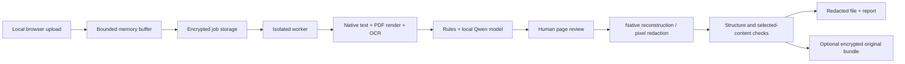

# 架构与边界 / Architecture and limits

[中文 README](../README.md) · [English README](../README.en.md)

## Data flow / 数据流

每份文件独立生成随机任务编号。上传在受总大小限制的内存缓冲中接收，随后原件和任务内容进入加密存储。后台队列每次处理一个任务；工作进程调用本机 Ollama，并使用指定的本地 OCR 权重。识别结果必须定位到原文片段或页面坐标。

Each file receives a random job ID. A bounded memory buffer prevents the multipart parser's usual disk spool. Documents and task content are then encrypted. A sequential queue runs each task in a separate process. Detection must align to original text or image coordinates.

## Review and output / 复核与输出

- 所有页面必须确认，包括没有候选的页面。All pages require confirmation, including pages without candidates.
- 默认遮除候选，使用者可明确保留原文。Candidates are redacted by default; keeping content is an explicit review choice.
- 补充敏感词会在全文定位；新增候选使原页面确认失效。Additional terms are matched throughout the text and require renewed review.
- 图片手动框选按归一化坐标保存。Manual image rectangles use normalized coordinates.
- 复核版本改变后，旧导出入口失效。Changing the review revision invalidates previous download eligibility.

TXT/CSV 输出新文本；CSV 对公式型字段增加防护。DOCX/XLSX 重建干净文件，删除原有隐藏对象和附加结构，而不是在原压缩包上覆盖字符。PDF 以 300 DPI 渲染，在像素上遮挡并重建无原文字层的 PDF。图片重新编码，不继承原元数据。

Native Office output is deliberately simplified. Word headers/footers and notes are reviewed as regular text; hidden/deleted text and comments are not copied as hidden content. Excel hidden sheets/rows/columns are excluded; cached formula results become static values. Complex objects and formulas without cached results cause a clear failure. PDF output uses freshly encoded image pages.

## Recovery / 反脱敏

`.rdvault` 保存加密的完整原件，使用 Scrypt 派生密钥和 AES-GCM 认证加密。恢复时验证密码、密文、成品摘要及原件摘要，恢复的扩展名来自加密元数据。成品被修改或恢复包不匹配时拒绝还原。

The recovery bundle contains an encrypted complete original, not a plaintext replacement dictionary. Restoring checks the password, authentication tag, redacted-output digest and original digest. It restores exact original bytes and does not merge subsequent edits. A recovered original includes its original hidden data and layout.

## Storage and privacy / 存储与隐私

`runtime/private` 中原件、预览、候选、成品、报告、恢复包及 SQLite 任务负载均加密。SQLite 仅明文保存任务 ID、状态和时间。当前 Windows 用户 DPAPI 保护主密钥；任务密钥不能通过复制到另一用户账户直接使用。启动器设置目录访问权限。恢复包可单独携带，不依赖原任务数据库。

Inactive jobs whose last update is older than 24 hours are selected from the entire database for cleanup, regardless of the UI's most-recent-200 list. Startup marks interrupted active jobs accordingly. Downloads saved by the user are outside automated cleanup.

The API binds to loopback and uses a short-lived, one-time pairing URL, an HttpOnly SameSite cookie, CSRF protection, Host/Origin checks and no-store responses. The browser's URL fragment is cleared after pairing. Access logging is disabled for the app. Model inference does not require an external API key.

## API overview / 接口概览

| Route | Purpose |
|---|---|
| `GET /api/health` | Health and version |
| `GET /api/session`, `POST /api/pair` | Local session bootstrap |
| `GET /api/capabilities` | Formats and local asset readiness |
| `POST /api/jobs`, `GET /api/jobs` | Import and list jobs |
| `GET /api/jobs/{id}/review` | Pages and candidates |
| `POST /api/jobs/{id}/review` | Save revision-checked human review |
| `POST /api/jobs/{id}/exports` | Queue a reviewed export |
| `GET /api/jobs/{id}/download/{kind}` | Verified redacted file, bundle or report |
| `POST /api/restore` | Restore from matching output, bundle and password |
| `POST /api/jobs/{id}/cancel`, `POST /api/jobs/{id}/retry` | Task control |
| `DELETE /api/jobs/{id}` | Remove an inactive local task |

除健康与配对引导外，API 要求本机会话；修改请求还要求 CSRF 头。完整接口参数可在启动后的 `/docs` 查看，但文档页本身不替代授权。

## Limits / 当前边界

- File input: 100 MiB; preview: 200 pages/images; image: 40 million pixels.
- TXT/CSV input: 8 million bytes; extracted text: 2 million characters.
- Worker timeout: 1 hour; local model request timeout and bounded output splitting are separate safeguards.
- No automatic deskew/rotation correction of scanned text; manual review remains essential.
- No PPT/PPTX, legacy DOC/XLS, macros, multi-frame images or general rich-Office-layout preservation.
- No authentication isolation against the same Windows user or administrators, and no OS-level network sandbox.
- Detection recall, handwritten text, small print, dense tables and document-level completeness need further benchmark work.
